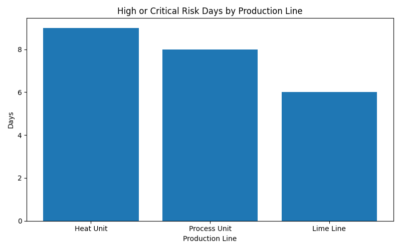

# Operations Risk Analysis Demo

A small Python project that analyzes synthetic operations data and turns it into simple business-oriented insights.

## Project overview
This project was built as a small practical data analysis demo. The aim was to simulate how operational data could be cleaned, analyzed, and translated into simple decision-support insights.

## Tools
- Python
- pandas
- numpy
- matplotlib

## What the project does
- generates synthetic operations data for three production units
- cleans missing values
- calculates KPIs such as energy per ton
- flags higher-risk patterns based on downtime, output, defects, and energy use
- creates a summary table, recommendations, and a simple chart

## Example output

## Why I built it
I built this project to practice using Python for practical data analysis and to improve my ability to connect technical findings to simple business recommendations.